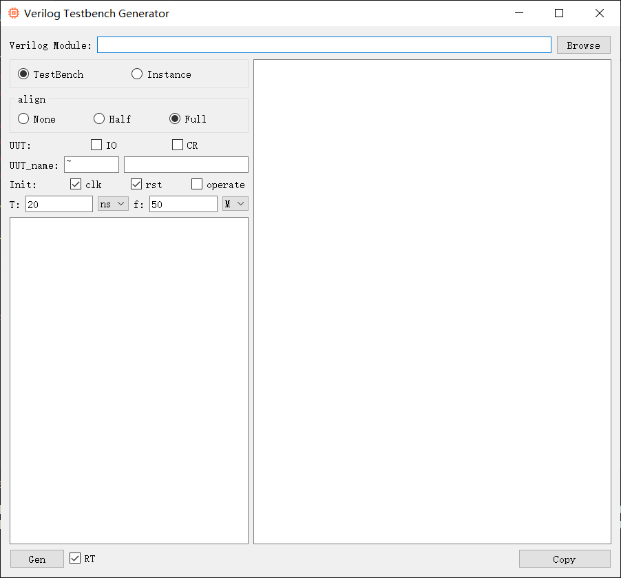
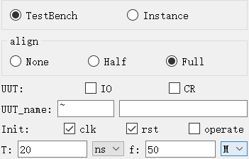

**English | [简体中文](README_cn.md)**
<div id="top"></div>

[![Contributors][contributors-shield]][contributors-url]
[![Forks][forks-shield]][forks-url]
[![Stargazers][stars-shield]][stars-url]
[![Issues][issues-shield]][issues-url]
[![License][license-shield]][license-url]


<!-- PROJECT LOGO -->
<br />
<div align="center">
    <a href="https://github.com/MoonGrt/Testbench_Gen">
    
    </a>
<h3 align="center">Testbench_Gen</h3>
    <p align="center">
    Verilog Testbench_Gen, based on PyQt, streamlines Verilog testbench creation by automating module parsing, testbench generation, and simulation integration.
    <br />
    <a href="https://github.com/MoonGrt/Testbench_Gen"><strong>Explore the docs »</strong></a>
    <br />
    <a href="https://github.com/MoonGrt/Testbench_Gen">View Demo</a>
    ·
    <a href="https://github.com/MoonGrt/Testbench_Gen/issues">Report Bug</a>
    ·
    <a href="https://github.com/MoonGrt/Testbench_Gen/issues">Request Feature</a>
    </p>
</div>


<!-- CONTENTS -->
<details open>
  <summary>Contents</summary>
  <ol>
    <li><a href="#file-tree">File Tree</a></li>
    <li>
      <a href="#about-the-project">About The Project</a>
      <ul>
      </ul>
    </li>
    <li><a href="#contributing">Contributing</a></li>
    <li><a href="#license">License</a></li>
    <li><a href="#contact">Contact</a></li>
    <li><a href="#acknowledgments">Acknowledgments</a></li>
  </ol>
</details>


<!-- FILE TREE -->
## File Tree

```
└─ Project
  ├─ LICENSE
  ├─ README.md
  ├─ README_cn.md
  ├─ requirements.txt
  ├─ run.bat
  ├─ Testbench_Gen.py
  ├─ Testbench_Gen_GUI.py
  └─ /Document/images/
    └─ logo.png
```


<!-- ABOUT THE PROJECT -->
## About The Project

<p style=" margin-top:0px; margin-bottom:0px; margin-left:0px; margin-right:0px; -qt-block-indent:0; text-indent:0px;">&quot;Testbench_Gen&quot; is a PyQt-based GUI tool designed to automatically generate testbenches and instance code for Verilog modules. By performing syntax parsing on the user-provided Verilog module, the tool extracts key information such as input/output ports and parameters, and generates the corresponding testbench code. </p>
<p align="center" style=" margin-top:0px; margin-bottom:0px; margin-left:0px; margin-right:0px; -qt-block-indent:0; text-indent:0px;"></p>
<p style=" margin-top:0px; margin-bottom:0px; margin-left:0px; margin-right:0px; -qt-block-indent:0; text-indent:0px;">Users can choose between two modes: &quot;Testbench&quot; mode for generating a full testbench, and &quot;Instance&quot; mode for quickly generating instance code. Additionally, the tool provides three instantiation modes: &quot;None&quot; for no instantiation code, &quot;Half&quot; for partial instantiation code, and &quot;Full&quot; for complete instantiation code.</p>
<p style=" margin-top:0px; margin-bottom:0px; margin-left:0px; margin-right:0px; -qt-block-indent:0; text-indent:0px;">To accommodate different user needs, Testbench_Gen allows users to customize the instance name (with the default name using '~' to represent the original module name). The tool also includes a built-in clock calculator that automatically generates clock signal code based on user-input clock frequency or period, simplifying clock-related development tasks.</p>
<p align="center" style=" margin-top:0px; margin-bottom:0px; margin-left:0px; margin-right:0px; -qt-block-indent:0; text-indent:0px;"></p>
<p style="-qt-paragraph-type:empty; margin-top:0px; margin-bottom:0px; margin-left:0px; margin-right:0px; -qt-block-indent:0; text-indent:0px;"><br /></p></body></html>
<p align="right">(<a href="#top">top</a>)</p>


<!-- CONTRIBUTING -->
## Contributing

Contributions are what make the open source community such an amazing place to learn, inspire, and create. Any contributions you make are **greatly appreciated**.
If you have a suggestion that would make this better, please fork the repo and create a pull request. You can also simply open an issue with the tag "enhancement".
Don't forget to give the project a star! Thanks again!
1. Fork the Project
2. Create your Feature Branch (`git checkout -b feature/AmazingFeature`)
3. Commit your Changes (`git commit -m 'Add some AmazingFeature'`)
4. Push to the Branch (`git push origin feature/AmazingFeature`)
5. Open a Pull Request
<p align="right">(<a href="#top">top</a>)</p>


<!-- LICENSE -->
## License

Distributed under the MIT License. See `LICENSE` for more information.
<p align="right">(<a href="#top">top</a>)</p>


<!-- CONTACT -->
## Contact

MoonGrt - 1561145394@qq.com
Project Link: [MoonGrt/Testbench_Gen](https://github.com/MoonGrt/Testbench_Gen)

<p align="right">(<a href="#top">top</a>)</p>


<!-- ACKNOWLEDGMENTS -->
## Acknowledgments

* [Choose an Open Source License](https://choosealicense.com)
* [GitHub Emoji Cheat Sheet](https://www.webpagefx.com/tools/emoji-cheat-sheet)
* [Malven's Flexbox Cheatsheet](https://flexbox.malven.co/)
* [Malven's Grid Cheatsheet](https://grid.malven.co/)
* [Img Shields](https://shields.io)
* [GitHub Pages](https://pages.github.com)
* [Font Awesome](https://fontawesome.com)
* [React Icons](https://react-icons.github.io/react-icons/search)
<p align="right">(<a href="#top">top</a>)</p>


<!-- MARKDOWN LINKS & Document/images -->
<!-- https://www.markdownguide.org/basic-syntax/#reference-style-links -->
[contributors-shield]: https://img.shields.io/github/contributors/MoonGrt/Testbench_Gen.svg?style=for-the-badge
[contributors-url]: https://github.com/MoonGrt/Testbench_Gen/graphs/contributors
[forks-shield]: https://img.shields.io/github/forks/MoonGrt/Testbench_Gen.svg?style=for-the-badge
[forks-url]: https://github.com/MoonGrt/Testbench_Gen/network/members
[stars-shield]: https://img.shields.io/github/stars/MoonGrt/Testbench_Gen.svg?style=for-the-badge
[stars-url]: https://github.com/MoonGrt/Testbench_Gen/stargazers
[issues-shield]: https://img.shields.io/github/issues/MoonGrt/Testbench_Gen.svg?style=for-the-badge
[issues-url]: https://github.com/MoonGrt/Testbench_Gen/issues
[license-shield]: https://img.shields.io/github/license/MoonGrt/Testbench_Gen.svg?style=for-the-badge
[license-url]: https://github.com/MoonGrt/Testbench_Gen/blob/master/LICENSE
