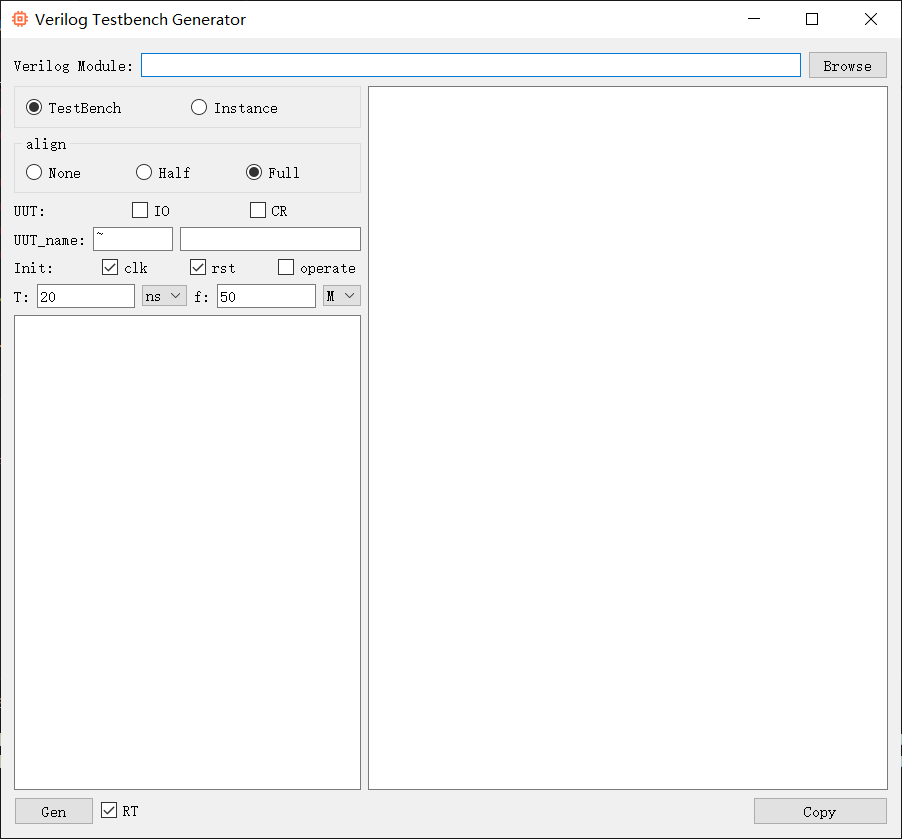
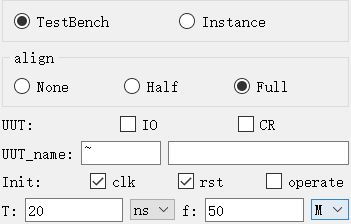

**简体中文 | [English](README.md)**
<div id="top"></div>

[![Contributors][contributors-shield]][contributors-url]
[![Forks][forks-shield]][forks-url]
[![Stargazers][stars-shield]][stars-url]
[![Issues][issues-shield]][issues-url]
[![License][license-shield]][license-url]


<!-- PROJECT LOGO -->
<br />
<div align="center">
    <a href="https://github.com/MoonGrt/Testbench_Gen">
    
    </a>
<h3 align="center">Testbench_Gen</h3>
    <p align="center">
    Verilog Testbench_Gen 基于 PyQt，可自动进行模块解析、测试台生成和仿真集成，从而简化 Verilog 测试台创建过程。
    <br />
    <a href="https://github.com/MoonGrt/Testbench_Gen"><strong>Explore the docs »</strong></a>
    <br />
    <a href="https://github.com/MoonGrt/Testbench_Gen">View Demo</a>
    ·
    <a href="https://github.com/MoonGrt/Testbench_Gen/issues">Report Bug</a>
    ·
    <a href="https://github.com/MoonGrt/Testbench_Gen/issues">Request Feature</a>
    </p>
</div>


<!-- CONTENTS -->
<details open>
  <summary>目录</summary>
  <ol>
    <li><a href="#文件树">文件树</a></li>
    <li>
      <a href="#关于本项目">关于本项目</a>
      <ul>
      </ul>
    </li>
    <li><a href="#贡献">贡献</a></li>
    <li><a href="#许可证">许可证</a></li>
    <li><a href="#联系我们">联系我们</a></li>
    <li><a href="#致谢">致谢</a></li>
  </ol>
</details>


<!-- 文件树 -->
## 文件树

```
└─ Project
  ├─ LICENSE
  ├─ README.md
  ├─ README_cn.md
  ├─ requirements.txt
  ├─ run.bat
  ├─ Testbench_Gen.py
  ├─ Testbench_Gen_GUI.py
  └─ /images/
    └─ logo.png
```


<!-- 关于本项目 -->
## 关于本项目

<p style=" margin-top:0px; margin-bottom:0px; margin-left:0px; margin-right:0px; -qt-block-indent:0; text-indent:0px;">“Testbench_Gen”是一款基于PyQt开发的GUI工具，旨在为Verilog模块自动生成测试平台（Testbench）和实例化代码。通过对用户输入的Verilog模块进行语法解析，软件可以提取模块的输入输出端口、参数（parameters）等关键信息，进而生成相应的testbench代码。</p>
<p align="center" style=" margin-top:0px; margin-bottom:0px; margin-left:0px; margin-right:0px; -qt-block-indent:0; text-indent:0px;"></p>
<p style=" margin-top:0px; margin-bottom:0px; margin-left:0px; margin-right:0px; -qt-block-indent:0; text-indent:0px;">用户可以选择两种模式：“Testbench”模式用于生成完整的测试平台；“Instance”模式用于快速生成模块的实例化代码。此外，软件提供三种实例化方式：“None”表示不添加任何实例化代码，“Half”表示生成部分实例化代码，“Full”表示生成完整的实例化代码。</p>
<p style=" margin-top:12px; margin-bottom:12px; margin-left:0px; margin-right:0px; -qt-block-indent:0; text-indent:0px;">为了满足用户的不同需求，Testbench_Gen支持用户自定义模块实例化名称（默认名称使用‘~’替代模块原名）。软件内置时钟计算器，用户可以根据输入的时钟频率或时钟周期自动生成时钟信号代码，进一步简化时钟相关的开发工作。</p>
<p align="center" style=" margin-top:0px; margin-bottom:0px; margin-left:0px; margin-right:0px; -qt-block-indent:0; text-indent:0px;"></p>
<p style="-qt-paragraph-type:empty; margin-top:0px; margin-bottom:0px; margin-left:0px; margin-right:0px; -qt-block-indent:0; text-indent:0px;"><br /></p></body></html>
<p align="right">(<a href="#top">top</a>)</p>


<!-- 贡献 -->
## 贡献

贡献让开源社区成为了一个非常适合学习、互相激励和创新的地方。你所做出的任何贡献都是**受人尊敬**的。

如果你有好的建议，请复刻（fork）本仓库并且创建一个拉取请求（pull request）。你也可以简单地创建一个议题（issue），并且添加标签「enhancement」。不要忘记给项目点一个 star！再次感谢！

1. 复刻（Fork）本项目
2. 创建你的 Feature 分支 (`git checkout -b feature/AmazingFeature`)
3. 提交你的变更 (`git commit -m 'Add some AmazingFeature'`)
4. 推送到该分支 (`git push origin feature/AmazingFeature`)
5. 创建一个拉取请求（Pull Request）
<p align="right">(<a href="#top">top</a>)</p>


<!-- 许可证 -->
## 许可证

根据 MIT 许可证分发。打开 [LICENSE.txt](LICENSE.txt) 查看更多内容。
<p align="right">(<a href="#top">top</a>)</p>


<!-- 联系我们 -->
## 联系我们

MoonGrt - 1561145394@qq.com
Project Link: [MoonGrt/Testbench_Gen](https://github.com/MoonGrt/Testbench_Gen)

<p align="right">(<a href="#top">top</a>)</p>


<!-- 致谢 -->
## 致谢

在这里列出你觉得有用的资源，并以此致谢。我已经添加了一些我喜欢的资源，以便你可以快速开始！

* [Choose an Open Source License](https://choosealicense.com)
* [GitHub Emoji Cheat Sheet](https://www.webpagefx.com/tools/emoji-cheat-sheet)
* [Malven's Flexbox Cheatsheet](https://flexbox.malven.co/)
* [Malven's Grid Cheatsheet](https://grid.malven.co/)
* [Img Shields](https://shields.io)
* [GitHub Pages](https://pages.github.com)
* [Font Awesome](https://fontawesome.com)
* [React Icons](https://react-icons.github.io/react-icons/search)
<p align="right">(<a href="#top">top</a>)</p>


<!-- MARKDOWN LINKS & IMAGES -->
<!-- https://www.markdownguide.org/basic-syntax/#reference-style-links -->
[contributors-shield]: https://img.shields.io/github/contributors/MoonGrt/Testbench_Gen.svg?style=for-the-badge
[contributors-url]: https://github.com/MoonGrt/Testbench_Gen/graphs/contributors
[forks-shield]: https://img.shields.io/github/forks/MoonGrt/Testbench_Gen.svg?style=for-the-badge
[forks-url]: https://github.com/MoonGrt/Testbench_Gen/network/members
[stars-shield]: https://img.shields.io/github/stars/MoonGrt/Testbench_Gen.svg?style=for-the-badge
[stars-url]: https://github.com/MoonGrt/Testbench_Gen/stargazers
[issues-shield]: https://img.shields.io/github/issues/MoonGrt/Testbench_Gen.svg?style=for-the-badge
[issues-url]: https://github.com/MoonGrt/Testbench_Gen/issues
[license-shield]: https://img.shields.io/github/license/MoonGrt/Testbench_Gen.svg?style=for-the-badge
[license-url]: https://github.com/MoonGrt/Testbench_Gen/blob/master/LICENSE

